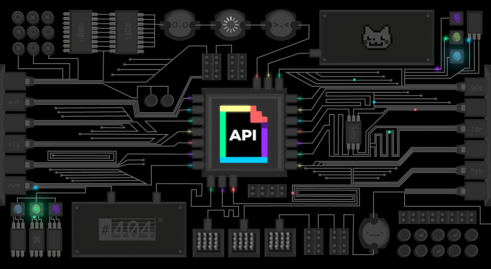

<!--  -->

## Hi there 👋


<h2 align="center">Hi. I’m Emilio</h2>
<br/>
<p align="center">

</p>
<br/>
<div align="center">

</div> 

<!--   -->
 
| | |
| - | - |
|Full Name      |Emilio Hulber (Remac)|
|Location           | CA, Ontario, Ottawa|
|Profession     | Security Engineer & Full-Stack Developer |
|Query From Me: |    Shell Scripting|
|Contact Email         |    mailto:emiliohulbert2017@gmail.com|
| | |

##


<p align="center">
<samp>A Security Engineer,coder,ctf player and Full-stack Developer from Kenya</samp>
<br/>
<br/>
<strong><a href="https://emiliohulbert.github.io/">My Portfolio »</a></strong>
</p>
<br/>

<!-- <h3 align="left">Activities:</h3>

- 🌱 I’m currently learning **C & C++ Programming**
- 👯 I’m looking to learn ideas,and experiment new things
- 💬 Ask me about Shell Scripting
- 📫 How to reach me **mailto:emiliohulbert2017@gmail.com**

<br/>
 -->


# 💻 Tech Stack:
<!-- 

 


 

 


 


 

 


 


 -->

<br/>


<table align="center">
  <tr>
    <td align="center"></td>
    <td align="center"></td>
    <td align="center"></td>
    <td align="center"></td>
    <td align="center"></td>
    <td align="center"></td>
    
  </tr>
  <tr>
    <td align="center"></td>
    <td align="center"></td>
    <td align="center"></td>
      <td align="center"></td>
    <td align="center"></td>
    <td align="center"></td>
  </tr>
  <tr>
    <td align="center"></td>
    <td align="center"></td>
    <td align="center"></td>
    <td align="center"></td>
    <td align="center"></td>
    <td align="center"></td>
  </tr>
  <tr>
    <td align="center"></td>
    <td align="center"></td>
    <td align="center"></td>
    <td align="center"></td>
    <td align="center"></td>
    <td align="center"></td>
  </tr>
    
   <tr>
    <td align="center"></td>
    <td align="center"></td>
    <td align="center"></td>
    <td align="center"></td>
    <td align="center"></td>
    <td align="center"></td>
  </tr>
  <tr>
      
   <td align="center"></td>
  </tr>

</table>


<h3 align="left">🏆 Github Trophies:</h3>
<p align="center">
  
</p>
<br/>

<div align="center">

</div> 


## Certification Badges 🪶

<div style='display:flex; align-items:center; gap: 10px;' align='center'>

  <a href="https://academy.hackthebox.com/achievement/badge/d9da1f60-8293-11f0-9254-bea50ffe6cb4" target="_blank">
    
  </a>
  
  <a href="https://academy.hackthebox.com/achievement/badge/2bce3d23-f797-11f0-9254-bea50ffe6cb4" target="_blank">
    
  </a>
<a href="https://academy.hackthebox.com/achievement/badge/cadea6b4-f78a-11f0-9254-bea50ffe6cb4" target="_blank">
    
  </a>
  
  <a href="https://www.credly.com/badges/c2edaee0-1a9a-484f-9b24-275dbf1e1446/public_url" target="_blank">
    
  </a>

   <a href="https://www.credly.com/badges/d626fcb3-dc61-4bd7-b586-3089823e110a" target="_blank">
    
  </a>
  
  <a href="https://academy.mobilehackinglab.com/admin/api/certificate_v2/661be95c60428f9d100f6ef2/user/68244a6f33c01dbbc50a30fd?lw_client=63942c32c9a203516ce07c09&access_token=" target="_blank">
    
  </a>
</div>

<h4 align="center">
  
```diff
+@ @ @ @ @ @ @ @ @ @ @ @ @ @ @ @ @ @ @ @ @ @ @ @ @ @ @ @+
@@       o o                                           @@
@@       | |                                           @@
@@      _L_L_                                          @@
@@   ❮\/__-__\/❯ Programming isn't about what you know @@
@@   ❮(|~o.o~|)❯  It's about what you can figure out   @@
@@   ❮/ \`-'/ \❯                                       @@
@@     _/`U'\_                                         @@
@@    ( .   . )     .----------------------------.     @@
@@   / /     \ \    | while( ! (succeed=try() ) ) |     @@
@@   \ |  ,  | /    '----------------------------'     @@
@@    \|=====|/                                        @@
@@     |_.^._|                                         @@
@@     | |"| |                                         @@
@@     ( ) ( )   Testing leads to failure              @@
@@     |_| |_|   and failure leads to understanding    @@
@@ _.-' _j L_ '-._                                     @@
@@(___.'     '.___)                                    @@
+@ @ @ @ @ @ @ @ @ @ @ @ @ @ @ @ @ @ @ @ @ @ @ @ @ @ @ @+
```

</h4>  


<div align="center">

</div> 
 
 
<table align="center" width="100%" cellspacing="0" cellpadding="0" border="0">
  <!-- Row 1: Laptop and Remac Stats -->
  <tr>
    <td align="center" bgcolor="#24283b" width="50%" style="height: 195px; vertical-align: middle;">
      
    </td>
    <td align="center" bgcolor="#24283b" width="50%" style="height: 195px; vertical-align: middle;">
      
    </td>
  </tr>
  <!-- Row 2: Languages and Streaks -->
  <tr>
    <td align="center" bgcolor="#24283b" width="50%" style="height: 195px; vertical-align: middle;">
      
    </td>
    <td align="center" bgcolor="#24283b" width="50%" style="height: 195px; vertical-align: middle;">
      <a href="https://git.io/streak-stats">
        
      </a>
    </td>
  </tr>
</table>


### 🔗 Connect With Me

<div style="display: flex; gap: 10px;">
  <a href="https://www.linkedin.com/in/emilio-hulbert-0ba27a307" target="_blank">
    
  </a>
  <a href="#" target="_blank">
    
  </a>
  <a href="#" target="_blank">
    
  </a>
  <a href="#" target="_blank">
    
  </a>

  <a href="https://open.spotify.com/user/atziry.34" target="_blank">
    
  </a>
</div>
<p align="left">
  <a href="https://twitter.com/videquod" target="blank">
    
  </a>
</p>

<!---
  
 is a ✨ special ✨ repository because its `README.md` (this file) appears on your GitHub profile.
You can click the Preview link to take a look at your changes.
--->
<h3 align="left">Support:</h3>
<p><a href="https://www.buymeacoffee.com/lilplucky"> </a><a href="https://ko-fi.com/lilplucky"> </a></p><br><br>


<!-- Cyan Wave Footer - shorter height -->

<!--  -->


